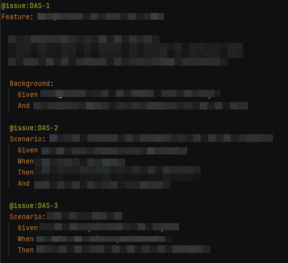
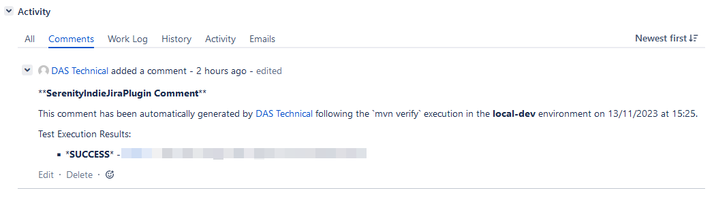
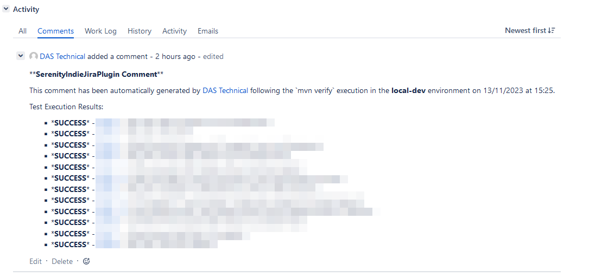

# Serenity Indie Jira Plugin

## Overview
The Serenity Indie Jira Plugin is a Maven plugin designed to postprocess Serenity test reports and to integrate seamlessly with JIRA.

It's creation is primarily motivated to serve as the workaround solution while official [serenity-jira-plugin](https://github.com/serenity-bdd/serenity-core/tree/main/serenity-jira-plugin) is temporarily disrupted and fails on two ways integration with JIRA.

https://github.com/serenity-bdd/serenity-core/discussions/3322

It provides automated updates and report processing capabilities. 
This tool is ideal for teams looking to streamline their test reporting and issue tracking within the JIRA ecosystem.

## Features
- **JIRA Integration**: Directly interfaces with JIRA REST API to update issues based on test results.
- **Serenity Report Processing**: Processes Serenity test reports and updates JIRA issues accordingly.
- **Comment Generation**: Automatically generates and posts comments in JIRA issues based on test outcomes.
- **Report Conversion**: Converts test reports to a format suitable for JIRA consumption.

## Project Structure
- `client`: Handles the connection and communication with JIRA REST API.
- `converter`: Responsible for converting test reports to the required format.
- `model`: Defines data models like `JiraComment`, `TestReport`, and `TestResult`.
- `processor`: Contains logic for processing test results and generating JIRA comments.
- `util`: Utility classes supporting various functionalities of the plugin.

## Getting Started
### Prerequisites
- Java 8 or higher.
- Maven 3.6.0 or higher.
- Access to a JIRA instance.
- Previously generated Serenity test reports

### Installation
1. Clone the repository: git clone [repository-url]
2. Navigate to the project directory: cd serenity-indie-jira-plugin
3. Install the plugin using Maven: mvn install


### Configuration
To configure the plugin for your project, modify your `pom.xml` to include properties and the plugin dependency:

```xml
<project xmlns="http://maven.apache.org/POM/4.0.0"
         xmlns:xsi="http://www.w3.org/2001/XMLSchema-instance"
         xsi:schemaLocation="http://maven.apache.org/POM/4.0.0 http://maven.apache.org/xsd/maven-4.0.0.xsd">
    
    ...
    <properties>
        <serenity-folder-path>D:\temp\serenity</serenity-folder-path>
        <jira-server-instance-url>https://jira-test.mycompany.com</jira-server-instance-url>
        <jira-project-key>jira-project-key</jira-project-key>
        <plugin-execution-environment>local-dev</plugin-execution-environment>
        <jira-username>jira_technical</jira-username>
        <jira-password>jira_technical</jira-password>
    </properties>
    ...
    <build>
        <plugins>
            ...
            <plugin>
                <groupId>com.serenity-indie</groupId>
                <artifactId>jira-plugin</artifactId>
                <version>1.0-SNAPSHOT</version>
                <executions>
                    <execution>
                        <goals>
                            <goal>update-jira</goal>
                        </goals>
                    </execution>
                </executions>
            </plugin>
            ...
        </plugins>
    </build>
</project>
```

Replace the properties values with your specific JIRA and the execution details.

## Usage

To use the plugin, you need:
 - that features and/or scenarios are annotated with "@issue" annotation in your .feature file, as specified in Serenity documentation
 - the generated Serenity report



run the following Maven command:
"mvn clean verify" within your project

In Jira the comment should be created for the issue without child issues:


Or for the issue with child issues:


## Contributing
Contributions are welcome. Please follow the standard procedures for contributing to open source projects on GitHub.

## License
This project is licensed under  is licensed under the terms of the Apache License, Version 2.0. - see the LICENSE file for details.
